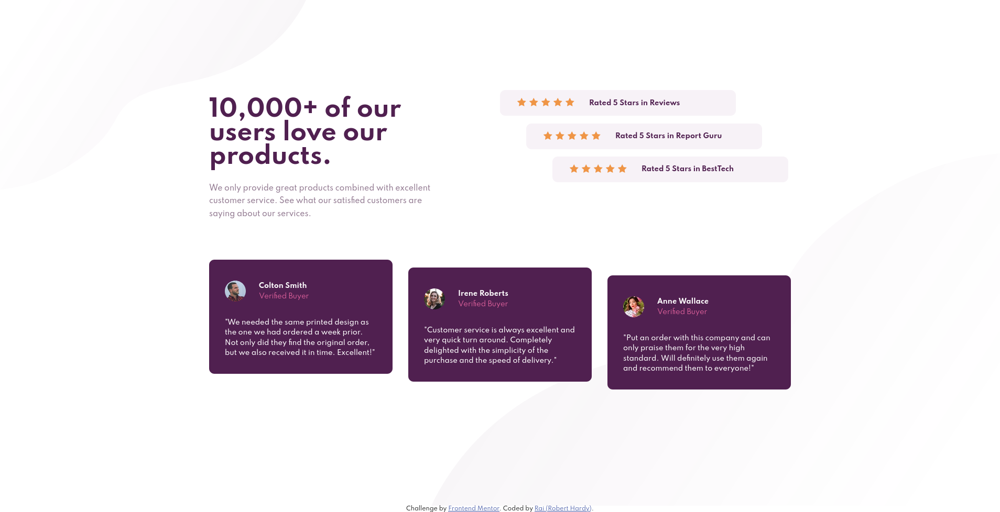

# Frontend Mentor - Social proof section solution

This is a solution to the [Social proof section challenge on Frontend Mentor](https://www.frontendmentor.io/challenges/social-proof-section-6e0qTv_bA). Frontend Mentor challenges help you improve your coding skills by building realistic projects.

## Table of contents

- [Overview](#overview)
  - [The challenge](#the-challenge)
  - [Screenshot](#screenshot)
  - [Links](#links)
- [My process](#my-process)
  - [Built with](#built-with)
  - [What I learned](#what-i-learned)
  - [Continued development](#continued-development)
  - [Useful resources](#useful-resources)
- [Author](#author)

## Overview

### The challenge

Users should be able to:

- View the optimal layout for the section depending on their device's screen size

### Screenshot

### Links

- Solution URL: [Github](https://github.com/RaiIsNotYourGuy/social-proof-section-master)
- Live Site URL: [Github](https://raiisnotyourguy.github.io/social-proof-section-master/)

## My process

### Built with

- Semantic HTML5 markup
- CSS custom properties
- Flexbox
- Mobile-first workflow

### What I learned

My continued learning of SVGs and flexboxes.

### Continued development

SVGs, flexboxes, code organization (utilzing IDs more).

### Useful resources

- [Guide to Flexbox](https://css-tricks.com/snippets/css/a-guide-to-flexbox/) - My go-to for helping with flexboxes.

## Author

- Website - [RaiIsNotYourGuy](https://www.github.com/raiisnotyourguy)
- Frontend Mentor - [@raiisnotyourguy](https://www.frontendmentor.io/profile/raiisnotyourguy)
- Twitter - [@raiisnotyourguy](https://www.twitter.com/raiisnotyourguy)
